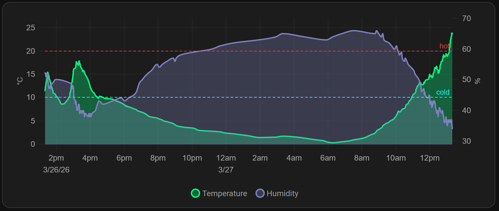
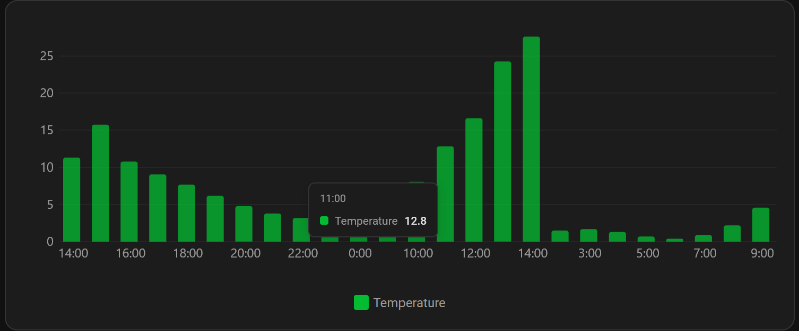
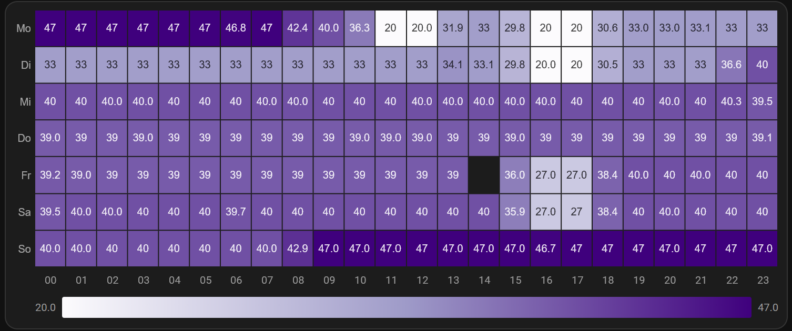

# Insight Cards

[](https://github.com/alex-jung/insight-card/releases)
[](https://github.com/alex-jung/insight-card/actions/workflows/ci.yml)
[](https://hacs.xyz)
[](https://www.home-assistant.io)
[](LICENSE)
[](https://github.com/alex-jung/insight-card/releases)

A modular collection of Dashboard cards for Home Assistant, installable via HACS.

## Screenshots

### Line Card



### Bar Card



### Heatmap Card



## Why Insight Cards?

Existing graph cards each have critical weaknesses:

- **mini-graph-card**: Simple but limited — no zoom, no visual editor, max 10 days history
- **ApexCharts-card**: Powerful but performance problems with many entities, YAML-only
- **Plotly-graph-card**: Interactive but steep learning curve, YAML-only

Insight Cards solves the paradox: **simplicity of mini-graph-card + performance of uPlot + visual editor**.

## Cards

| Card | Element | Status |
|------|---------|--------|
| Line / Area / Step Chart | `custom:insight-line-card` | ✅ Available |
| Bar Chart | `custom:insight-bar-card` | ✅ Available |
| Heatmap | `custom:insight-heatmap-card` | ✅ Available |
| Sankey | `custom:insight-sankey-card` | 📋 Planned |
| Compare | `custom:insight-compare-card` | 📋 Planned |

## Installation

### HACS (recommended)

1. Open HACS in Home Assistant
2. Click the menu → *Custom repositories*
3. Add `https://github.com/alex-jung/insight-card`, category *Dashboard*
4. Find *Insight Cards* in HACS, click the three-dot menu → *Download*
5. Reload your browser

### Manual

1. Download `insight-card.js` from the [latest release](https://github.com/alex-jung/insight-card/releases)
2. Copy it to `config/www/insight-card.js`
3. Add it as a resource in Home Assistant:
   - *Settings → Dashboards → Resources → Add resource*
   - URL: `/local/insight-card.js`, type: *JavaScript module*
4. Reload your browser

## Quick Start

No YAML required — all cards come with a fully featured **visual editor**.

1. Edit your dashboard
2. Click **+ Add card**
3. Search for **Insight** to find any Insight Cards card
4. Pick your entity/entities in the *General* section
5. Adjust time range, chart style, and appearance using the editor panels

The card updates live as you change settings — no manual YAML editing needed.

### Minimal YAML examples

```yaml
type: custom:insight-line-card
entities:
  - sensor.living_room_temperature
```

```yaml
type: custom:insight-bar-card
entities:
  - sensor.daily_energy_consumption
```

```yaml
type: custom:insight-heatmap-card
entities:
  - sensor.living_room_temperature
```

## Features

### Line Card (`custom:insight-line-card`)

- **Chart styles**: Line, Area (filled), Step (staircase)
- **Multi-entity**: Multiple entities, each with its own color and name
- **Dual Y axes**: Assign entities to primary or secondary axis independently
- **Zoom**: Drag to zoom in, click the reset button to restore the full range
- **Statistics API**: Use long-term statistics instead of raw history
- **Aggregation**: Client-side bucketing by configurable period
- **Transforms**: `diff` (change), `normalize` (0–1), `cumulative` (running sum)
- **Threshold lines**: Horizontal reference lines at fixed Y values
- **Color thresholds**: Gradient fill that changes color based on the Y value
- **Interactions**: `tap_action`, `double_tap_action`, `hold_action` (more-info, navigate, URL, service call)
- **Visual editor**: 5-section editor — General · Chart Style · Appearance · Interactions · Advanced

### Bar Card (`custom:insight-bar-card`)

- **Grouped & stacked** layouts
- **Aggregation**: `mean`, `sum`, `min`, `max` per bucket
- **Bucket sizes**: hour, day, week, month
- **Color thresholds**: Bar color changes based on value
- **Interactions**: `tap_action`, `double_tap_action`, `hold_action`
- **Visual editor**: 5-section editor — General · Chart Style · Appearance · Interactions · Advanced

### Heatmap Card (`custom:insight-heatmap-card`)

- **Layouts**: `hour_day` (columns = days, rows = hours), `weekday_hour`, `month_day`
- **Color scales**: `YlOrRd`, `Blues`, `Greens`, `RdBu`, `Viridis`, `Plasma`, `Purples`, `Oranges` + custom stops
- **Reverse scale**, fixed `value_min` / `value_max` for normalisation
- **Cell styling**: gap, corner radius, empty cell color, optional value labels with configurable decimals
- **Axes**: X-axis column labels, Y-axis row labels, horizontal colorbar
- **Hover tooltip**: cell value + time label with edge-flip positioning
- **Interactions**: `tap_action`, `double_tap_action`, `hold_action`
- **Visual editor**: 5-section editor — General · Color Scale · Appearance · Interactions · Advanced

## Requirements

- Home Assistant **2025.5.0** or newer.

## Contributing

Bug reports and feature requests are welcome via [GitHub Issues](https://github.com/alex-jung/insight-card/issues).

## License

MIT
